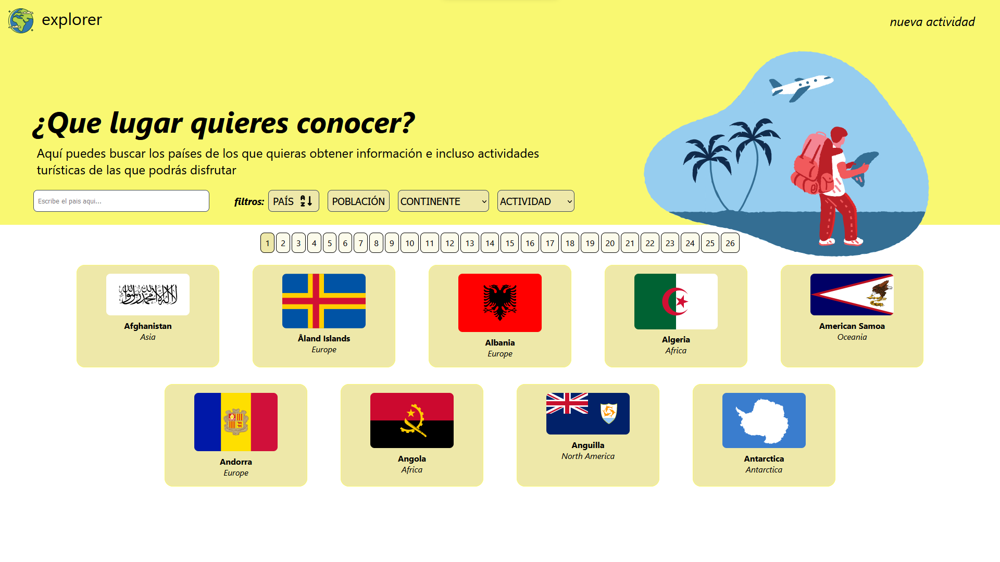

# explorer

  

## Description

Single Page Application about countries that consumes data from an external API and preloads the information into a database to be used by the project's API.

It is developed with the following technologies:

- JavaScript
- Frontend: ReactJs, Redux, HTML, CSS.
- Backend: Node.js, Express.js, Sequelize.
- DataBase: PostgreSQL.

## Project features
- Filtering options by continent and tourist activities.
- Sort options by alphabetical order and population.
- Search by countries.
- Detailed view of the countries with their tourist activities.
- List of tourist activities.
- Modification and creation of activities.

------

## Descripción

Es una Single Page Aplication sobre países que consume datos de una API externa y los precarga a una base de datos para ser usada por la API del proyecto.

Está desarrollada con las siguientes tecnologías:

- JavaScript
- Frontend: ReactJs, Redux, HTML, CSS.
- Backend: Node.js, Express.js, Sequelize.
- Base de datos: PostgreSQL.

## Características del Proyecto
- Opciones de filtrado por continente y actividad turística.
- Opciones de ordenamiento por orden alfabético y cantidad de población.
- Búsqueda por países.
- Vista en detalle de los países con sus actividades turísticas.
- Listado de actividades turísticas.
- Modificación y creación de actividades.